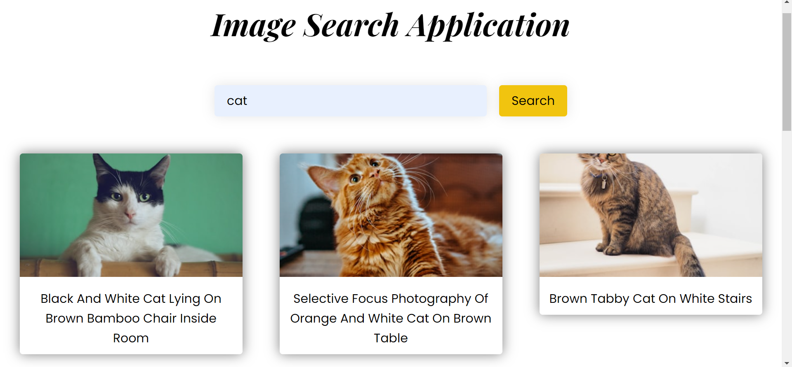

# Image Search Application

Application Link : [https://rutik675lt.github.io/SimpleCalculatorJS/](https://rutik675lt.github.io/ImageSearchAPP/)


SimpleCalculatorJS is a minimalist and visually appealing web-based calculator built using HTML CSS and JS. It's designed to perform basic arithmetic operations and provides a user-friendly interface for quick calculations.
Image Search Application is a basic app which is made using HTML CSS JS. It is a versatile application which returns user desired images on the unsplash website. This is possilbe with the help of unsplash API

## Features

- **Global Search:** Search bar which use unsplash API for images.

- **Responsive Design** Interactive UI for mobile as well as Computer.

## Getting Started

### Prerequisites

No prerequisites are needed for running the application, as it runs directly in the browser without any additional setup.

### Running Locally

To run application on your local machine:

1. Clone the repository:
   ```bash
   git clone https://github.com/RUTIK675LT/ImageSearchAPP.git
